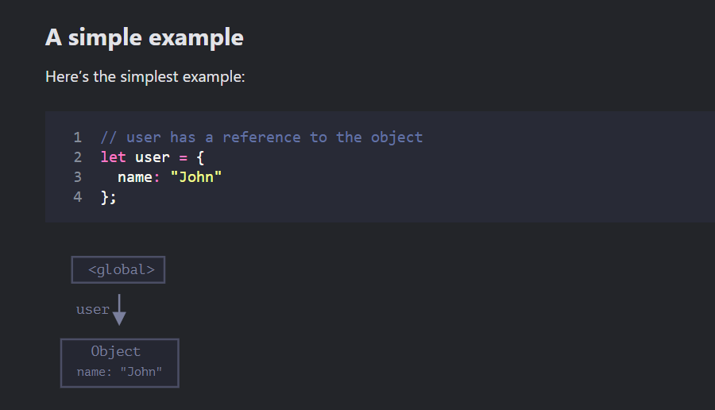
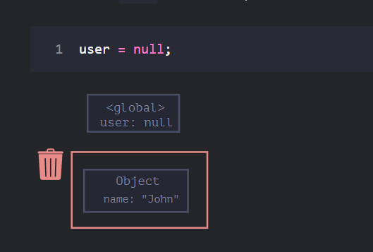
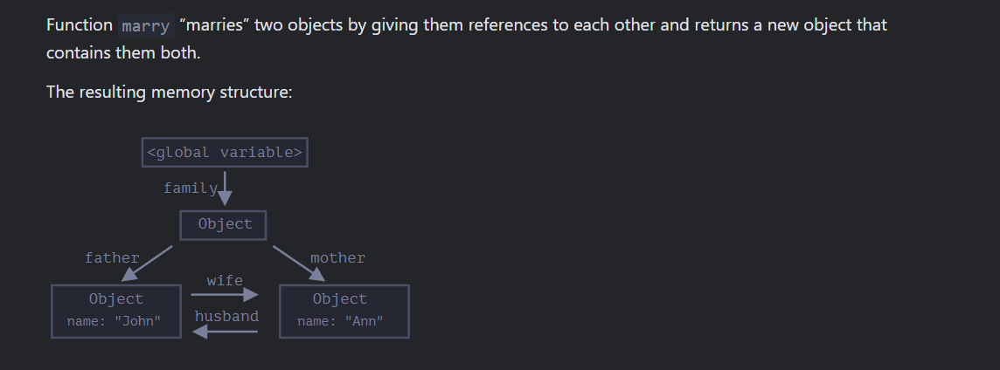
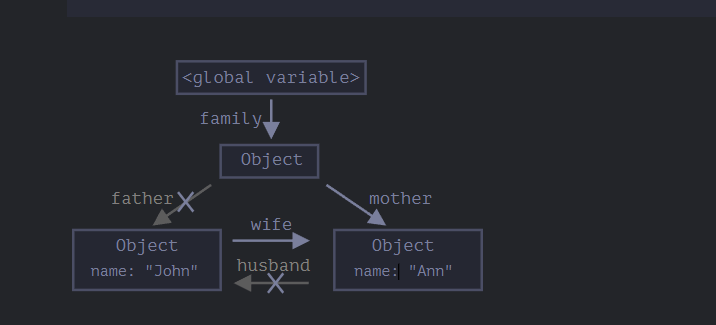

## Garbage collection

## It is simple example for the garbage colletion

## Here the arrow depicts an object reference. The global variable "user" references the object {name: "John"} (we’ll call it John for brevity). The "name" property of John stores a primitive, so it’s painted inside the object.

## If the value of user is overwritten, the reference is lost:

## Interlinked objects

## Link for code https://github.com/JavascriptDev347/js-deep-core/blob/dev/object/garbage_collection.js#L21

## Result

## if we write https://github.com/JavascriptDev347/js-deep-core/blob/dev/object/garbage_collection.js#L23-L24
## Result

